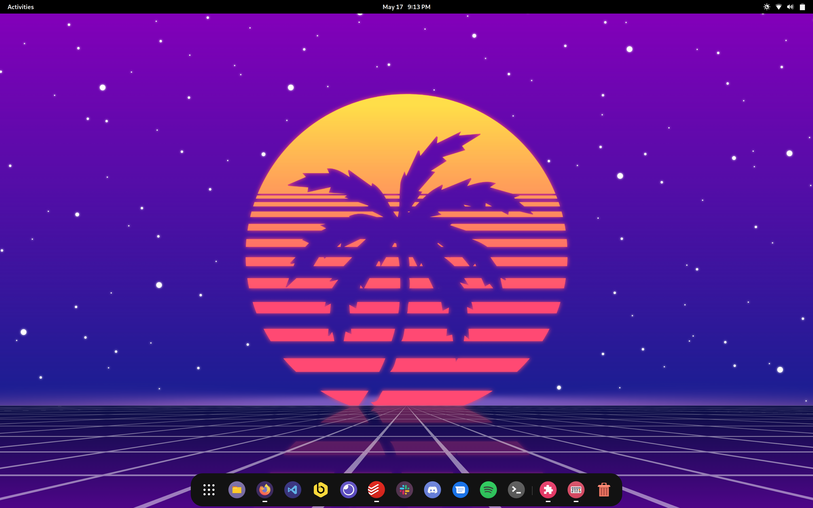
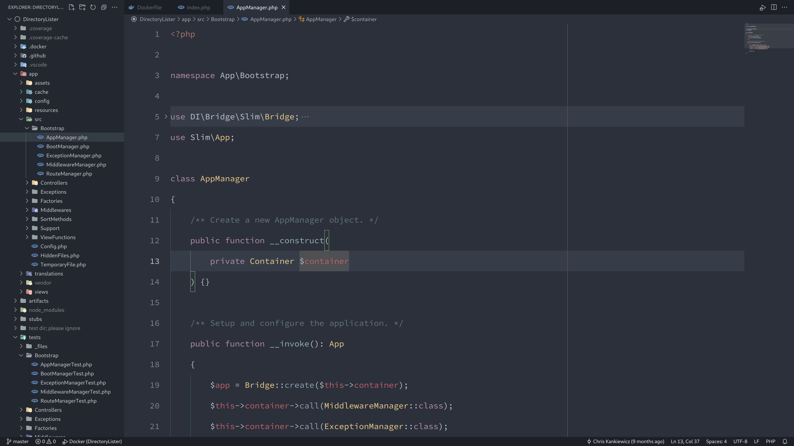

Uses
====

Occasionally I'm asked what tools I use regularly so I've put together this "uses" document to list them out in detail.

Hardware
--------

My primary workhorse is my laptop, a [Lenovo X1 Carbon (Gen 9)](https://www.lenovo.com/us/en/p/laptops/thinkpad/thinkpadx1/x1-carbon-gen9/22tp2x1x1c9). I take it with me everywhere and connect it to my dock for a desk setup when I'm at home.

### Specs

|            |                           |
| ---------- | ------------------------- |
| **CPU**    | Intel i7-1185G7 @ 3.0 GHz |
| **RAM**    | 32 GB LPDDR4 @ 4266MHz    |
| **Disk**   | 512 GB NVMe SSD           |
| **Screen** | 14.0" UHD+ (3840 x 2400)  |

Operating System
----------------

I use [Arch Linux](https://archlinux.org) as my daily driver with the [GNOME](https://www.gnome.org) desktop environment.

  
### GNOME Extensions

  - [ddterm](https://extensions.gnome.org/extension/3780/ddterm/) - Drop down terminal
  - [Switcher](https://extensions.gnome.org/extension/973/switcher/) - Switch windows or launch applications quickly
  - [Dash to Dock](https://extensions.gnome.org/extension/307/dash-to-dock/) - A floating dock for Gnome Shell
  - [Hide Top Bar](https://extensions.gnome.org/extension/545/hide-top-bar/) - Autohide the top bar for maximum screen real estate
  - [Notification Banner Reloaded](https://extensions.gnome.org/extension/4651/notification-banner-reloaded/) - Configure notification banner position
  - [Coverflow Alt-Tab](https://extensions.gnome.org/extension/97/coverflow-alt-tab/) - Replaces Alt-Tab with a cover flow animation
  - [Impatience](https://extensions.gnome.org/extension/277/impatience/) - Speed up Gnome Shell animations
  - [Arch Linux Updates Indicator](https://extensions.gnome.org/extension/1010/archlinux-updates-indicator/)
  - [Fullscreen Hot Corner](https://extensions.gnome.org/extension/1562/fullscreen-hot-corner/)
  - [Window is Ready - Notification Remover](https://extensions.gnome.org/extension/1007/window-is-ready-notification-remover/)

Editor
------

For software development I use [Visual Studio Code](https://code.visualstudio.com) with the [Spacegray VSCode](https://marketplace.visualstudio.com/items?itemName=ionutvmi.spacegray-vscode) theme and the [file-icons](https://marketplace.visualstudio.com/items?itemName=file-icons.file-icons) extension with a minimal UI to help me maintain focus on the code.

### VS Code Extensions

The following are some (but not all) of the extensions I use on a daily basis.

##### General

  - [Project Manager](https://marketplace.visualstudio.com/items?itemName=alefragnani.project-manager)
  - [EditorConfig for VS Code](https://marketplace.visualstudio.com/items?itemName=EditorConfig.EditorConfig)
  - [Better Folding](https://marketplace.visualstudio.com/items?itemName=MohammadBaqer.better-folding)
  - [Markdown All in One](https://marketplace.visualstudio.com/items?itemName=yzhang.markdown-all-in-one)
  - [File Utils](https://marketplace.visualstudio.com/items?itemName=sleistner.vscode-fileutils)
  - [new-file](https://marketplace.visualstudio.com/items?itemName=fnando.new-file)
  - [Bookmarks](https://marketplace.visualstudio.com/items?itemName=alefragnani.Bookmarks)
  - [Todo Tree](https://marketplace.visualstudio.com/items?itemName=Gruntfuggly.todo-tree)	
  - [CodeSnap](https://marketplace.visualstudio.com/items?itemName=adpyke.codesnap)

##### PHP

  - [PHP Intelephense](https://marketplace.visualstudio.com/items?itemName=bmewburn.vscode-intelephense-client)
  - [PHP Namespace Resolver](https://marketplace.visualstudio.com/items?itemName=MehediDracula.php-namespace-resolver)
  - [PHP Add Property](https://marketplace.visualstudio.com/items?itemName=kotfire.php-add-property)
  - [PHP DocBlocker](https://marketplace.visualstudio.com/items?itemName=neilbrayfield.php-docblocker)
  - [laravel intellisense](https://marketplace.visualstudio.com/items?itemName=mohamedbenhida.laravel-intellisense)
  - [laravel-blade](https://marketplace.visualstudio.com/items?itemName=cjhowe7.laravel-blade)
  - [Simple PHP CS Fixer 3](https://marketplace.visualstudio.com/items?itemName=PHLAK.simple-php-cs-fixer-3)
  - [PHP Static Analysis](https://marketplace.visualstudio.com/items?itemName=breezelin.phpstan)
  - [PHP Debug](https://marketplace.visualstudio.com/items?itemName=xdebug.php-debug)
  - [phpcs](https://marketplace.visualstudio.com/items?itemName=ikappas.phpcs)

#### JavaScript

  - [Vue Language Features (Volar)](https://marketplace.visualstudio.com/items?itemName=Vue.volar)
  - [Prettier - Code formatter](https://marketplace.visualstudio.com/items?itemName=esbenp.prettier-vscode)
  - [ESLint](https://marketplace.visualstudio.com/items?itemName=dbaeumer.vscode-eslint)

Other Software
--------------

  - [Git Source Control](https://git-scm.com)
  - [Docker](https://www.docker.com) + [Docker Compose](https://docs.docker.com/compose/)
  - [Todoist](https://todoist.com)

Workspace
---------

When working from home I dock my laptop at my desk.

  - [Autonomous SmartDesk Core](https://www.autonomous.ai/standing-desks/smartdesk-2-home)
  - [Autonomous ErgoChair Pro](https://www.autonomous.ai/office-chairs/ergonomic-chair)
  - [Caldigit Element Hub](https://www.caldigit.com/thunderbolt-4-element-hub/)
  - [Dell Ultrasharp U2718Q 27-Inch 4K IPS Monitor](https://www.dell.com/en-si/work/shop/cty/pdp/spd/dell-u2718q-monitor)
  - [Microsoft Surface Keyboard (Wireless)](https://www.microsoft.com/en-us/d/surface-keyboard/8r3rqvvflp4k)
  - [Logitech G703 Mouse](https://www.logitechg.com/en-us/products/gaming-mice/g703-wireless-gaming-mouse.910-005091.html) + [Powerplay Wireless Charging Mouse Pad](https://www.logitechg.com/en-us/products/gaming-mouse-pads/powerplay-wireless-charging.943-000109.html)
  - [Monoprice DT-4BT 60-Watt Desktop Speakers](https://www.monoprice.com/product?p_id=36572)

On the Go
---------

While on the go I use a [GORUCK Echo](https://www.goruck.com/products/echo) 16L backpack to transport my laptop and peripherals.

  - [Soundcore Liberty Air 2 Pro Wirelss Earbuds](https://us.soundcore.com/collections/true-wireless/products/a3951011)
  - [Logitech MX Anywhere 3 Wireless Mouse](https://www.logitech.com/en-us/products/mice/mx-anywhere-3.910-005833.html)
