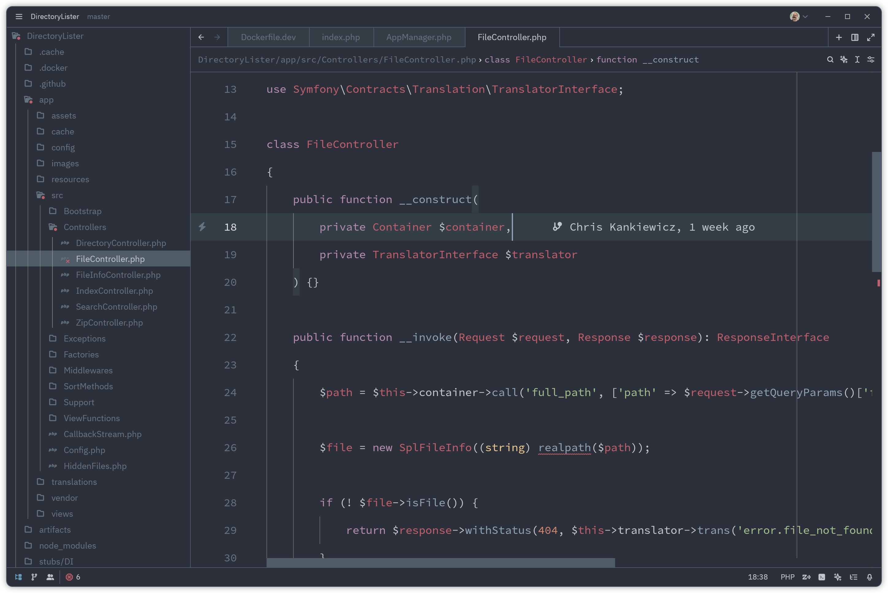

Uses
====

Occasionally I'm asked what tools I use regularly so I've put together this "uses" document to list them out in detail.

Hardware
--------

My primary workhorse is my laptop, a [Framework 13 (AMD)](https://frame.work/products/laptop-diy-13-gen-amd/). I take it with me everywhere and connect it to my dock for a desk setup when I'm at home.

### Specs

|            |                              |
| ---------- | ---------------------------- |
| **CPU**    | AMD Ryzen 7 7840U @ 3.3 GHz  |
| **RAM**    | 2 × 16 GB DDR5 @ 5600 MT/s   |
| **Disk**   | WD_BLACK SN850X 2TB NVMe SSD |
| **Screen** | 13.5" 2880 × 1920 120Hz      |

Operating System
----------------

I use [Arch Linux](https://archlinux.org) as my daily driver with the [GNOME](https://www.gnome.org) desktop environment.

### Apps and Extensions

  - [Ulauncher](https://ulauncher.io/) - Application launcher
  - [ddterm](https://extensions.gnome.org/extension/3780/ddterm/) - Drop down terminal
  - [Dash to Dock](https://extensions.gnome.org/extension/307/dash-to-dock/) - A floating dock for Gnome Shell
  - [Hide Top Bar](https://extensions.gnome.org/extension/545/hide-top-bar/) - Autohide the top bar for maximum screen real estate
  - [Coverflow Alt-Tab](https://extensions.gnome.org/extension/97/coverflow-alt-tab/) - Replaces Alt-Tab with a cover flow animation
  - [Impatience](https://extensions.gnome.org/extension/277/impatience/) - Speed up Gnome Shell animations
  - [Arch Linux Updates Indicator](https://extensions.gnome.org/extension/1010/archlinux-updates-indicator/)
  - [Window is Ready - Notification Remover](https://extensions.gnome.org/extension/1007/window-is-ready-notification-remover/)

Editor
------

For software development I use the [Zed code editor](https://zed.dev/) with the [Base16 Ocean](https://github.com/bswinnerton/base16-zed) theme. Zed comes with a minimal UI to help me maintain focus on the code.

Other Software
--------------

  - [Git Source Control](https://git-scm.com)
  - [Docker](https://www.docker.com) + [Docker Compose](https://docs.docker.com/compose/)
  - [Todoist](https://todoist.com)

Workspace
---------

When working from home I dock my laptop at my desk.

  - [Autonomous SmartDesk Core](https://www.autonomous.ai/standing-desks/smartdesk-2-home)
  - [Autonomous ErgoChair Pro](https://www.autonomous.ai/office-chairs/ergonomic-chair)
  - [Caldigit Element Hub](https://www.caldigit.com/thunderbolt-4-element-hub/)
  - [Dell Ultrasharp U2718Q 27-Inch 4K IPS Monitor](https://www.dell.com/en-si/work/shop/cty/pdp/spd/dell-u2718q-monitor)
  - [Microsoft Surface Keyboard (Wireless)](https://www.microsoft.com/en-us/d/surface-keyboard/8r3rqvvflp4k)
  - [Logitech G703 Mouse](https://www.logitechg.com/en-us/products/gaming-mice/g703-wireless-gaming-mouse.910-005091.html) + [Powerplay Wireless Charging Mouse Pad](https://www.logitechg.com/en-us/products/gaming-mouse-pads/powerplay-wireless-charging.943-000109.html)
  - [Monoprice DT-4BT 60-Watt Desktop Speakers](https://www.monoprice.com/product?p_id=36572)

On the Go
---------

While on the go I use a [GORUCK Echo](https://www.goruck.com/products/echo) 16L backpack to transport my laptop and peripherals.

  - [Soundcore Liberty 4 NC Wirelss Earbuds](https://us.soundcore.com/products/liberty-4-nc-a3947z11)
  - [Logitech MX Anywhere 3 Wireless Mouse](https://www.logitech.com/en-us/products/mice/mx-anywhere-3.910-005833.html)
